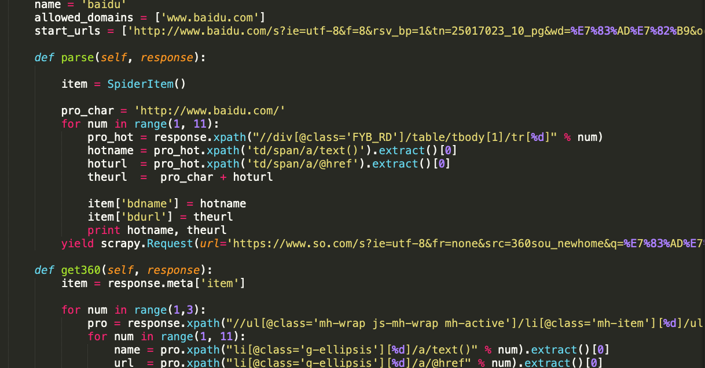

基于URL实时爬取百度、360、微博热点新闻爬虫接口
===

  

# 项目简介
spider-hotpoint作为一个热点显示网站的后端数据处理程序

如果有问题，请提issue

在参考本项目之前，也可先阅读[Scapy文档](https://scrapy-chs.readthedocs.io/zh_CN/0.24/intro/tutorial.html)，熟悉了解Scrapy!
# 交流分享

- 作者微信  


# 问题集锦

    Q:怎么实现实时性的？
    A:在Linux操作系统级别定时启动服务，更新实现实时更新数据至MySQL。

    Q:使用的是python 2 还是 3？
    A:python2，若出错，请报BUG。

# 安装scrapy
本人使用的是MAC系统，仅以此为例
Windows操作系统可自行百度，过程大同小异！


安装之后，输入scrapy命令发现commend not found
原因是Mac自带的python与pip不对应，所以重装了自己的python 如下

结束。
```
   sudo pip install Scrapy
```
如果出现scrapy命令发现commend not found，可能是Mac自带的python与pip冲突，可尝试如下操作  
```
   sudo rm -rf /usr/bin/python
   sudo ln -s /usr/local/bin/python /usr/bin/python
   pip install scrapy
```


# 使用

### 初始化 API

```python
   # mysql数据库
   MYSQL_HOST = '127.0.0.1'  #配置自己的数据库IP地址
   MYSQL_DBNAME = '******'   #配置自己的数据名
   MYSQL_USER = '******'     #配置自己的数据库用户
   MYSQL_PASSWD = '******'   #配置自己的数据库密码
```
### 在数据库中参照Items建立数据库

```
。。。此处省略。。。
```


### 启动Scrapy爬取热点数据

```
scrapy crawl baidu.py
```

# 微信公众号

咖啡是每个程序员的最爱！  
有了咖啡的陪伴，一个人才能度过coding之夜,
有了咖啡的陪伴，一个人的夜晚才算得上是完美。

本人，业余爱好咖啡，  
并经营一些咖啡相关商品，  
如果您也有喝咖啡的习惯，  
赶快来关注我的公众号吧，
~~~加我有优惠哦~~~  


# TODO
- [x] ~~将热点文章获取到实时性~~
- [ ] 接入scrapy爬虫框架
- [ ] 百度热点新闻获取
- [ ] 360热点新闻获取
- [ ] 微博热点新闻获取

---
